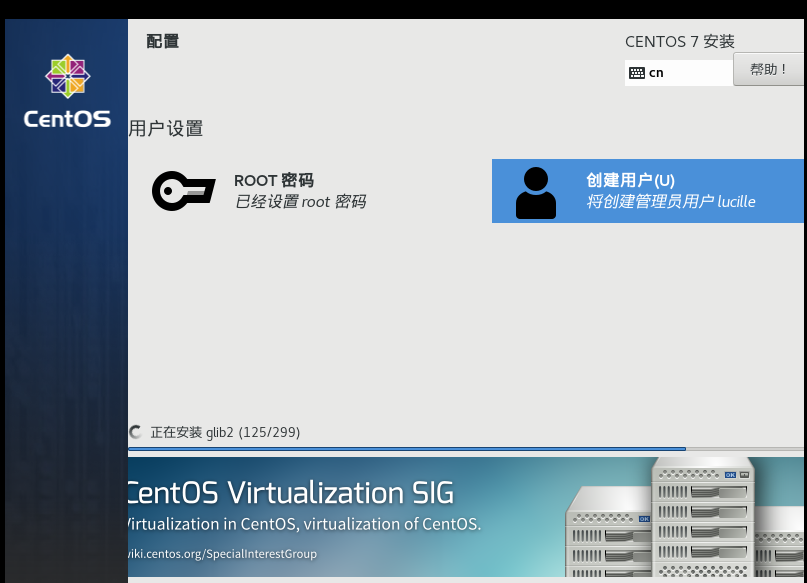
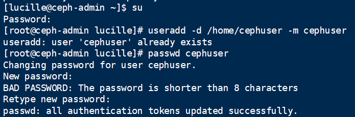
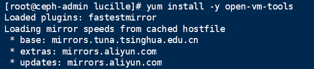
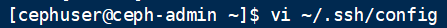
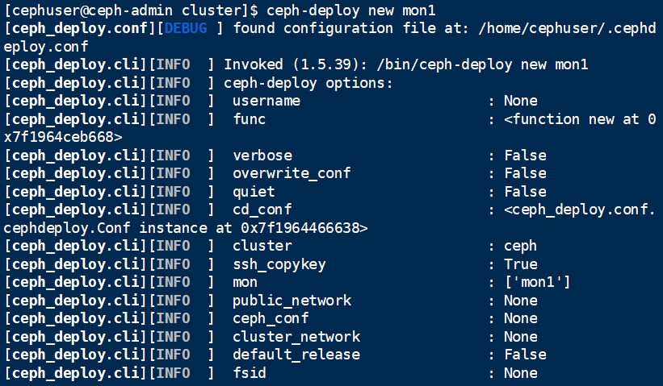
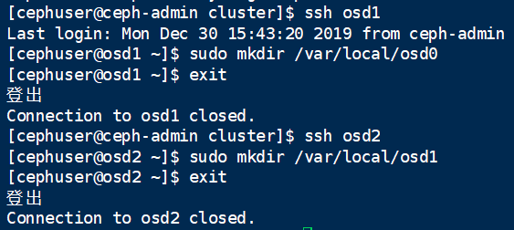

# Ceph的安装与实践 

-----------------------------------------------------------------------------------------------------

### 步骤1-在虚拟机上创建最小化centos

最小化镜像自取：<https://mirrors.tuna.tsinghua.edu.cn/centos/7.7.1908/isos/x86_64/>

最小化安装的参考教程：<https://blog.51cto.com/kingbin9z/1948033>

​                                        <https://www.cnblogs.com/wangqian723/p/7493991.html>





把上面的ip输入到FinalShell中，连接，以便后续操作


##### >以下参考教程：https://www.howtoforge.com/tutorial/how-to-build-a-ceph-cluster-on-centos-7/#step-configure-firewalld

#####                          >和课本148-149页


### **步骤2-配置所有节点**

#### **创建Ceph用户**

--------------------------------------------------------------------------------------------------------------

创建一个名为“**cephuser**‘在所有节点上。




在创建新用户之后，我们需要为“cephuser”配置sudo。他必须能够以root用户的身份运行命令，并且能够在没有密码的情况下获得root权限。

运行下面的命令，为用户创建一个sudoers文件，并使用sed编辑/etc/sudoers文件。


#### 安装和配置NTP

-------------------------------------------------------------------------------------------------------------

安装NTP以同步所有节点上的日期和时间。运行ntpdate命令通过NTP协议设置日期和时间，我们将使用US池NTP服务器。然后启动并启用NTP服务器在启动时运行。


#### 安装OpenVM工具

------------------------------------------------------------------------------------------------------------

如果您正在运行VMware中的所有节点，则需要安装此虚拟化实用程序。否则跳过这一步。



#### 禁用SELinux

------------------------------------------------------------------------------------------------------------

通过使用sed流编辑器编辑SELinux配置文件，在所有节点上禁用SELinux。


#### 克隆虚拟机得到mon1,osd1,osd2

-------------------------------------------------------------------------------------------------------------

三个克隆的虚拟机类似做法


节点mon1:


节点osd1:同上面的类似做法


节点osd2:同上面的类似做法


#### 配置主机文件

--------------------------------------------------------------------------------------------------------------

使用vim编辑器编辑所有节点上的/etc/host文件，并添加带有所有集群节点的IP地址和主机名的行。

```
vi /etc/hosts
粘贴下面的配置：
```


保存文件并退出vi。

现在，您可以尝试在服务器之间使用主机名进行ping，以测试网络连接性。例子：


### 步骤3-配置SSH服务器

--------------------------------------------------------------------------------------------------------------

在这个步骤中，我将配置**Ceph-admin节点**...管理节点用于配置监视器节点和osd节点。登录到Ceph-admin节点，并成为**cephuser**'.


管理节点用于安装和配置所有集群节点，因此Ceph-admin节点上的用户必须拥有连接到所有节点的特权，而不需要密码。我们必须为“Ceph-admin”节点上的“cephuser”配置无密码SSH访问。

生成ssh键**cephuser**'.


把密码空/空。

接下来，为ssh配置创建配置文件。



粘贴配置如下：


保存文件。

更改配置文件的权限。


现在，使用ssh-Copy-id命令将SSH密钥添加到所有节点。


在请求时输入您的“cephuser”密码。


完成后，尝试从Ceph-admin节点访问osd 1服务器。


### 步骤3-配置Firewalld

-------------------------------------------------------------------------------------------------------------

我们将使用Firewalld来保护系统。在这个步骤中，我们将在所有节点上启用Firewald，然后打开Ceph-Admon、Ceph-mon和Ceph-osd所需的端口。

登录到Ceph-admin节点并启动Firewalld。


打开端口80，2003和4505-4506，然后重新加载防火墙.


从Ceph-admin节点登录到监视器节点‘mon1’并启动Firewalld。


在Ceph监视器节点上打开新端口并重新加载防火墙。


最后，开放端口6800-7300对每个osd节点-osd 1，osd 2和os3。

从Ceph-admin节点登录到每个osd节点。


打开端口并重新加载防火墙。


完成了Firewalld配置。

下面是对节点osd2的同样处理：


### 步骤5-构建Ceph集群

------------------------------------------------------------------------------------------------------------

在这一步中，我们将在Ceph-admin节点上的所有节点上安装Ceph。

登录到Ceph-admin节点。


#### 在Ceph-admin节点上安装Ceph-Deploy

------------------------------------------------------------------------------------------------------------

添加Ceph存储库并安装Ceph部署工具‘**Ceph-Deploy**“使用yum命令。


确保更新所有节点。

安装了Ceph-Deploy工具之后，为Ceph集群配置创建一个新目录。

#### 创建新的集群Config

--------------------------------------------------------------------------------------------------------------

创建新的群集目录。


接下来，使用**Ceph-Deploy**命令，将监视器节点定义为**mon1**'.




//该命令将在集群目录中生成Ceph集群配置文件“ceph.conf”。

用vi编辑ceph.conf文件。


在[global]块下，粘贴下面的配置。


保存文件并退出vi。

#### 在所有节点上安装

-----------------------------------------------------------------------------------------------------------

现在，在Ceph-admin节点的所有其他节点上安装Ceph。这可以用一个命令来完成。


该命令将自动在所有节点上安装Ceph：mon1、osd 1-2和ceph-admin-安装将花费一些时间。

运行结束时如下错误：


解决办法：按如下操作，在每个节点上安装Ceph


修改成如下配置:


下面先修改一下各个节点的主机名


现在，配置初始monitor(s)并收集所有密钥。


查看当前目录里出现了以上的密钥环。

该命令将创建监视器键，使用“Ceph”命令检查并获取键。


### 步骤6-添加OSD节点

------------------------------------------------------------------------------------------------------------

（1）添加两个OSD进程。为了快速地安装，把目录而非整个硬盘用于OSD守护进程。登录到Ceph节点，并给OSD守护进程创建一个目录。



然后从管理节点执行ceph-deploy来准备OSD.


最后，激活OSD。

> $ceph-deploy osd activate osd1:/var/local/osd0 osd2:/var/local/osd1

（2）用ceph-deploy把配置文件和admin密钥复制到管理节点和ceph节点，这样，每次执行ceph命令时就无需指定Monitor地址和ceph.client.admin.keyring了。


ceph-deploy和本地管理主机(admin-node)通信时，必须通过主机名可达。必要时可修改/etc/hosts,加入管理主机的名字。

（3）确保对ceph.client.admin.keyring有正确的操作权限。


（4）查看是否能够进入ceph.


（5）检查集群的健康状况。


