# cloud-computing

# 云计算开发基础

## 购买腾讯云服务器

---

##### 购买腾讯云服务器

[学生套餐](https://cloud.tencent.com/act/campus?fromSource=gwzcw.2432687.2432687.2432687&utm_medium=cpc&utm_id=gwzcw.2432687.2432687.2432687)

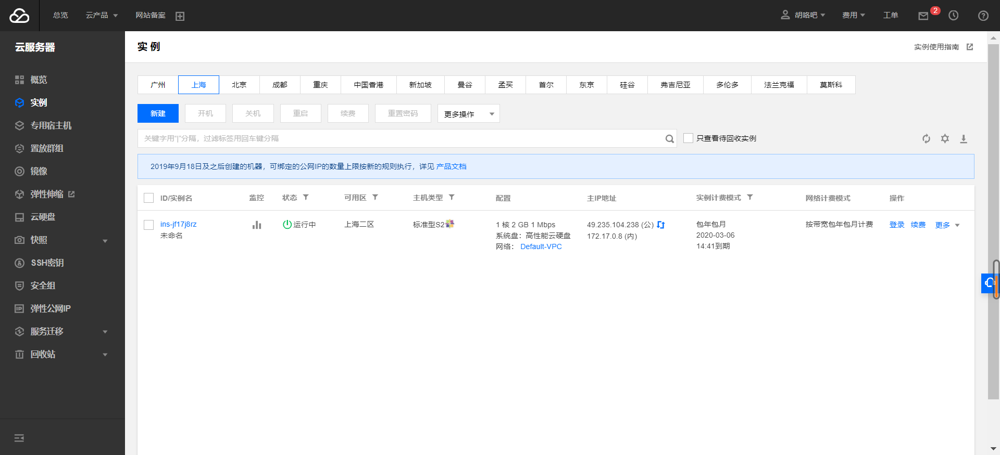

##### 使用Web Shell登录已购买的云服务器

##### 下载安装Xshell（包含在Xmanager中），并使用 Xshell登录腾讯云实例

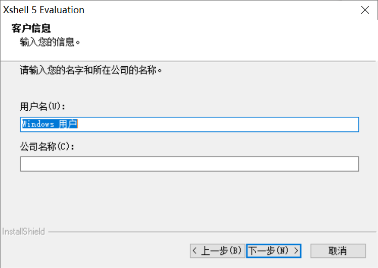

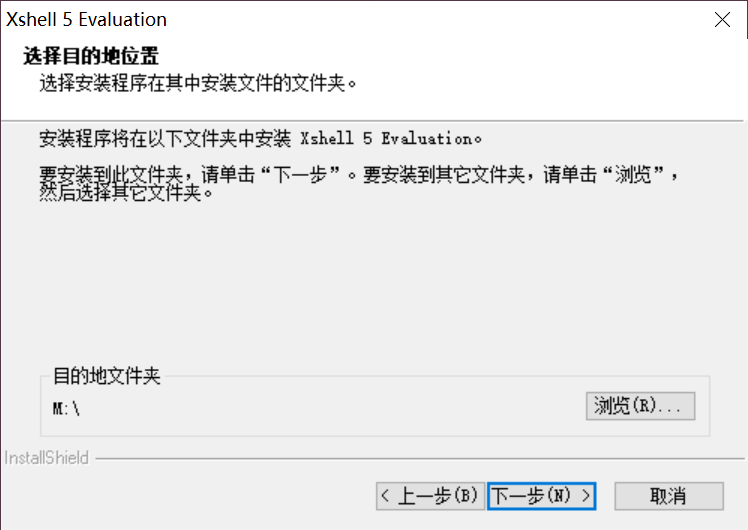

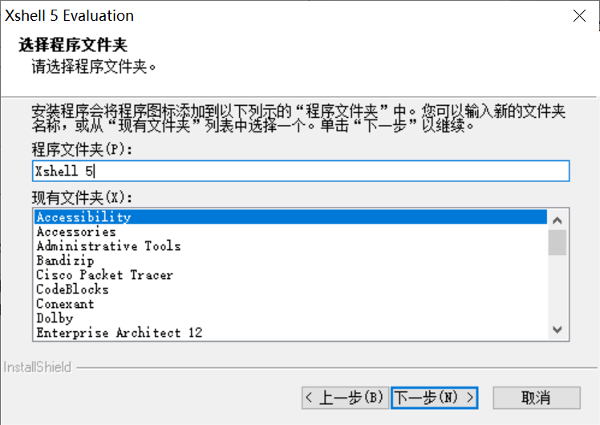

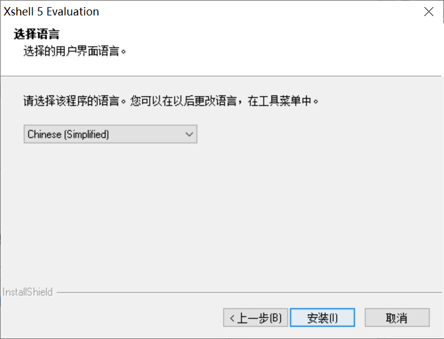

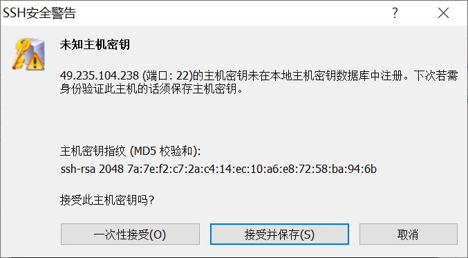

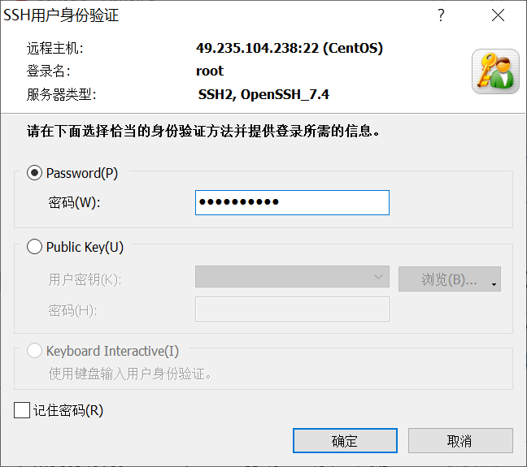

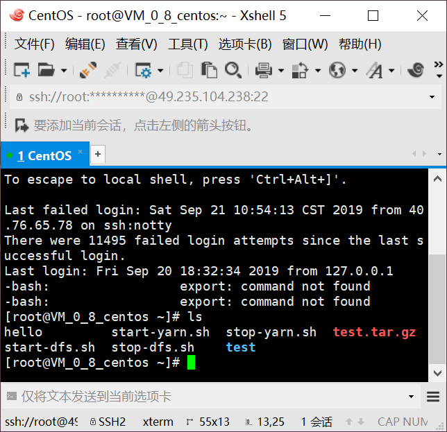

## 创建GitHub项目并在本地同步

---

### 注册GitHub账号

<https://github.com/>

### 安装Git

> 说明：Git Bash（基于MINGW） 是Windows下进行Git操作的Shell。
>
> ### 创建SSH KEY
>
> 1.验证是否存在ssh keys
>
> > ls -al ~/.ssh
> >
> > 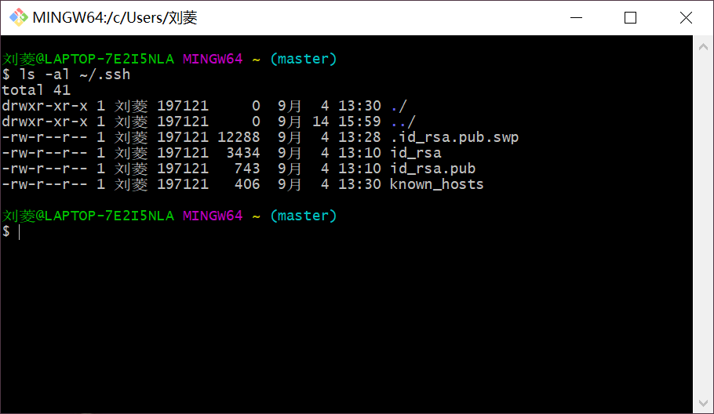
> >
> > ​	2.如果不存在ssh key,则新建一个
> >
> > > ssh-keygen -t rsa -b 4096 -C “your_email@example.com”
> > >
> > > 引号里面是Github邮箱地址。随后键入想要保存ssh key 的文件名
> > >
> > > > Enter a file in which to save the key 
> > > >
> > > > 这里建议不输入任何文件名，直接回车，这样就使用系统默认配置。随后复制"id_rsa.pub"的内容到GitHub网站的Settings—>SSH and GPG keys中：
> > > >
> > > > 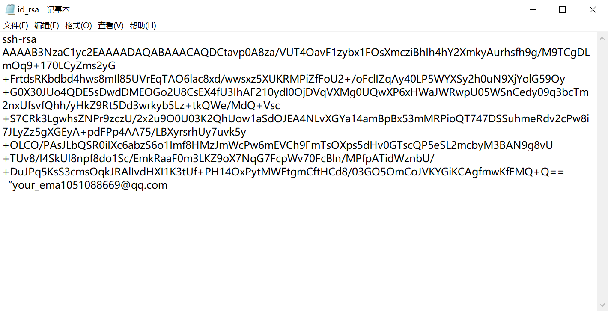

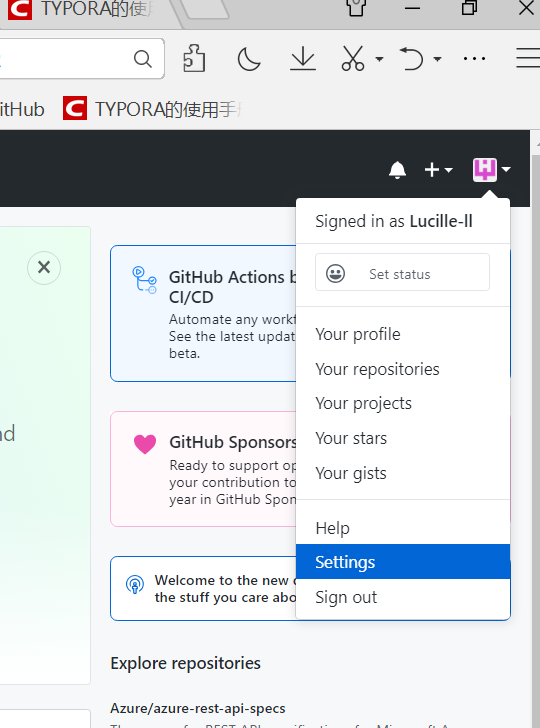

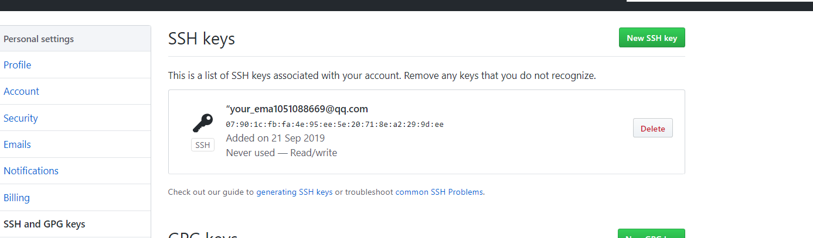

​		3.测试SSH Keys是否配置成功

> ssh -T git@github.com
>
> 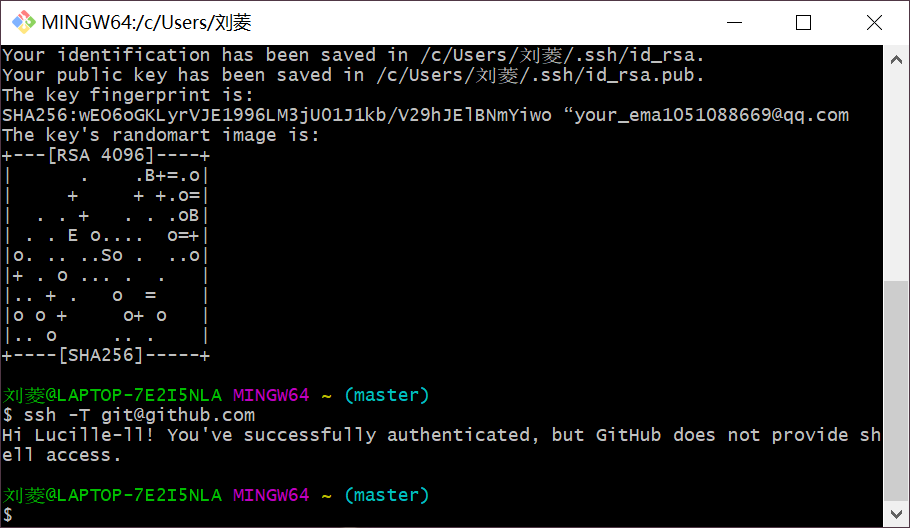

### 配置Github的用户名和邮箱

> git config --global user.name "your name"
>
> "your name"替换成GitHub用户名。
>
> > git config --global user.email “email@example.com”
> >
> > 这里的"email@example.com"替换成Github的邮箱
> >
> > ### 在GitHub上创建云计算项目（CloudComputing）并在 本地同步 教程
> >
> > <https://blog.csdn.net/llfjfz/article/details/99747385>
> >
> > 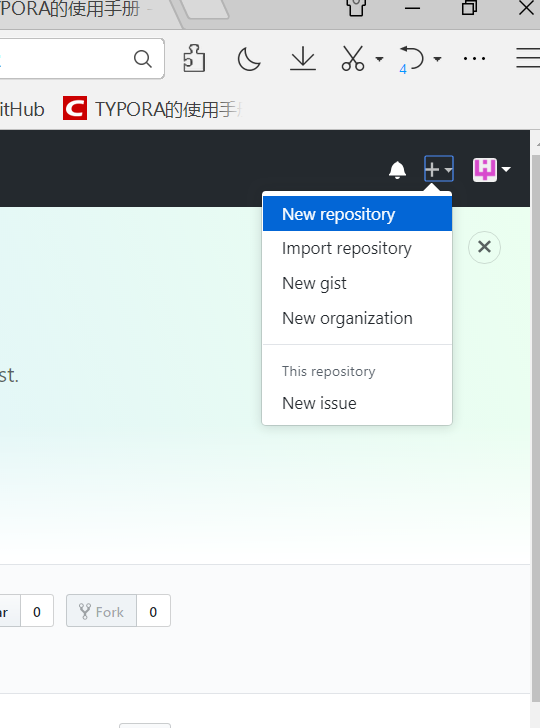
> >
> > 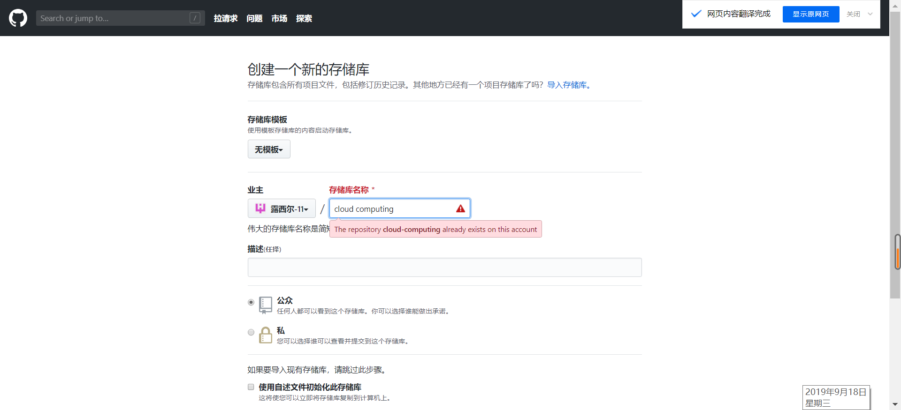
> >
> > 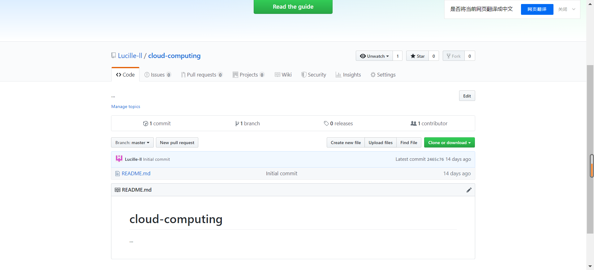

## 本地安装VMware Workstation和CentOS操作系统

---

###  自行安装VMware WorkStation 

>  任何版本都行，视自己机器的配置而定，比如VMware WorkStation9，12，或者15都可，版本越高要求的机器配置越 高。 
>
> ### 在VMware WorkStation安装CentOS操作系统 
>
> [相关教程](https://blog.csdn.net/llfjfz/article/details/98020426)

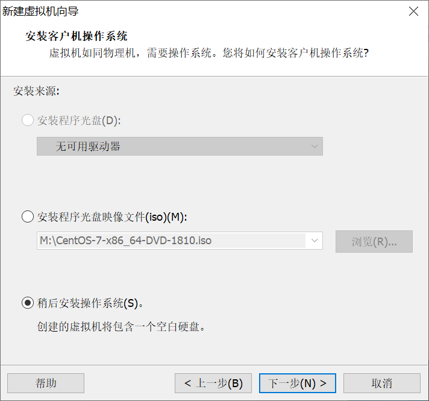

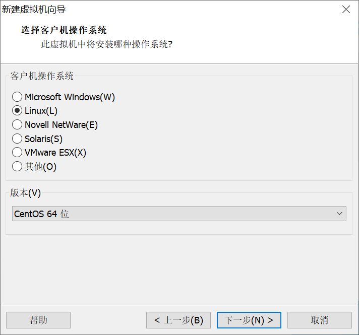

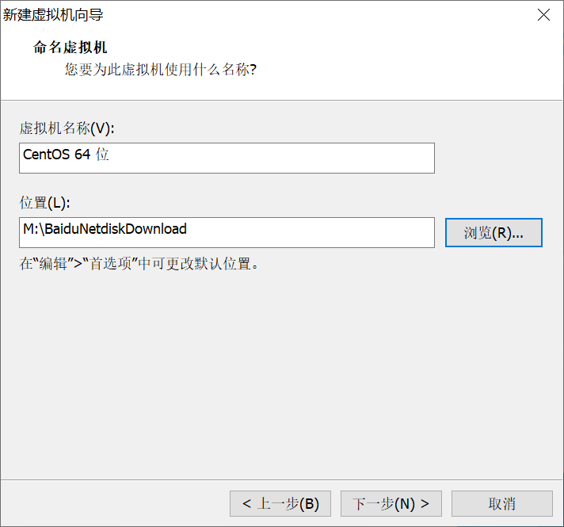

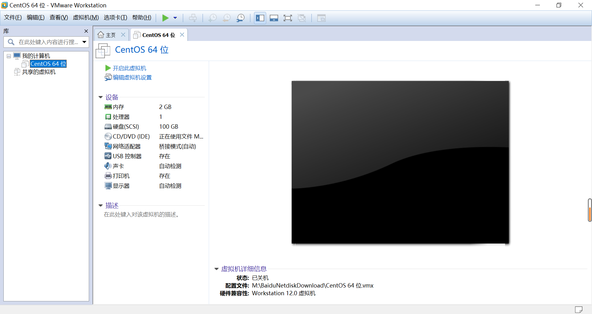

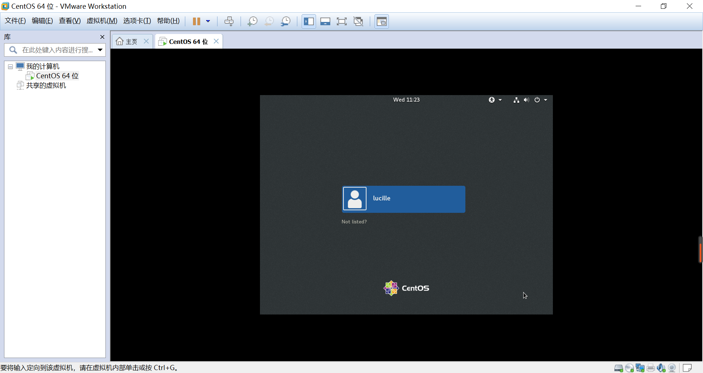

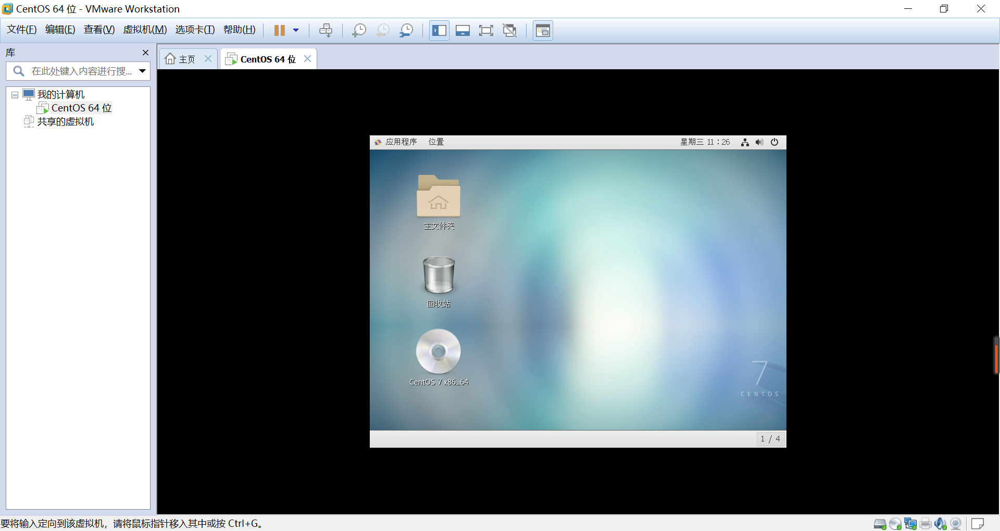

